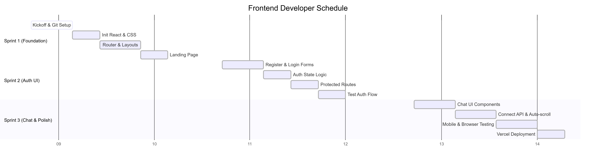

Project Roles & Gantt Charts

1. Role Task Breakdown

🎨 Frontend Developer

Focus: User Interface, React components, Client-side logic, and Final Polish.

Sprint 1: Foundation & Layout

1.1.1 - 1.2.4: Team Kickoff, Roles, Schedule, Git Setup (Shared)

1.3.1: Initialize React application with Vite

1.3.2: Set up basic CSS and styling

1.4.1: Set up React Router with basic routes

1.4.2: Create basic layout components

1.4.3: Build landing page

Sprint 2: Authentication UI

2.3.1: Create registration page with form

2.3.2: Create login page with form

2.3.3: Implement client-side authentication state management

2.3.4: Added protected route functionality

2.3.5: Test authentication flow end-to-end

Sprint 3: Chat Interface & Deployment

3.1.1: Design chat UI layout

3.1.2: Build message bubble components

3.1.3: Create chat input component with send functionality

3.1.4: Implement auto-scroll and loading states

3.1.5: Connect chat UI to backend API

3.1.6: Style chat interface with CSS

3.2.2: Test on Chrome, Firefox, Safari

3.2.3: Test responsive design on mobile

3.3.1: Set up Vercel for frontend deployment

3.4.2: Create user guide documentation

⚙️ Backend Developer

Focus: Server logic, Database, API Endpoints, and Production Infrastructure.

Sprint 1: Server & Database Init

1.1.1 - 1.2.4: Team Kickoff, Roles, Schedule, Git Setup (Shared)

1.3.3: Initialize Node.js/Express backend project

1.3.4: Set up PostgreSQL database locally

1.3.5: Configure Prism ORM and create initial schema

Sprint 2: API & Auth Logic

2.1.1: Design users table schema

2.1.2: Create and run database migrations

2.2.1: Implement user registration endpoint with bcrypt

2.2.2: Implement login endpoint with JWT token generation

2.2.3: Create JWT verification middleware

2.2.4: Test authentication endpoints

2.4.5: Create conversation endpoint (send/receive messages)

Sprint 3: Production & Stability

3.2.4: Fix critical bugs (P0/P1)

3.3.2: Set up Railway/Render for backend + PostgreSQL

3.3.3: Configure production environment variables

3.3.4: Run database migrations in production

3.3.5: Deploy and test production environment

🤖 AI Integration Specialist

Focus: AI Model selection, Prompt Engineering, and Logic wrapping.

Sprint 1: Planning

1.1.1 - 1.2.4: Team Kickoff, Roles, Schedule (Shared)

Research Phase (Implicit in Sprint 1 for AI)

Sprint 2: Model & Prompts

2.1.3: Create restaurant scenario content

2.4.1: Create Hugging Face account and get free API token

2.4.2: Test Mistral-7B model for Spanish conversation quality

2.4.3: Create AI service wrapper for API calls

2.4.4: Design system prompt template for restaurant scenario

2.4.6: Test basic AI conversation flow

Sprint 3: Evaluation & Demo

3.2.1: Test all user flows end-to-end (QA Focus)

3.4.1: Write README with setup instructions

3.4.3: Prepare demo presentation slides

3.4.4: Test with 10-15 external users for feedback

2. Gantt Charts

Frontend Timeline

Backend Timeline

AI Integration Timeline

